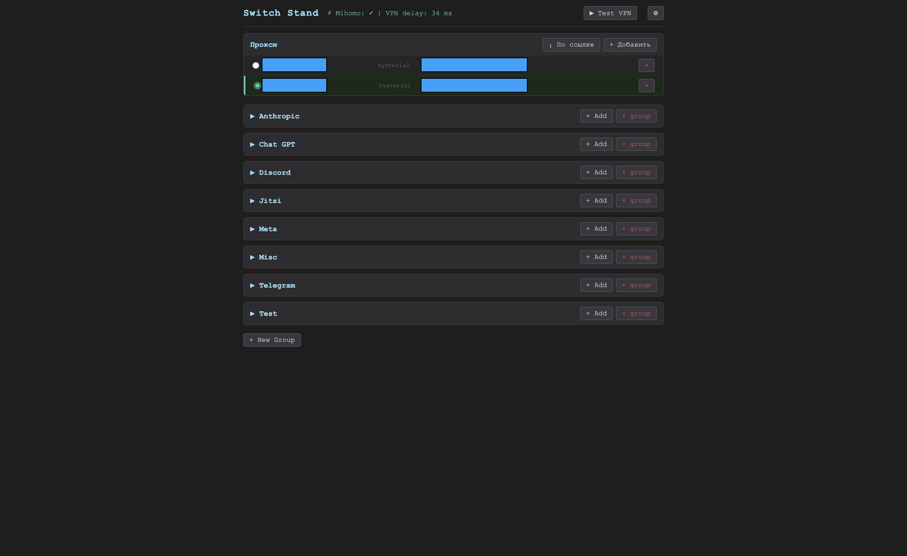

# switch_stand

Selective VPN на MikroTik hAP ax3: контейнер mihomo гонит выбранный трафик через Hysteria2 на VPS, а Switch Stand — веб-морда для управления правилами маршрутизации и прокси-серверами.



## Быстрый старт

**Требования:** MikroTik роутер с RouterOS 7.x, поддержка контейнеров включена, USB-накопитель примонтирован как `usb1`, mihomo-контейнер запущен на `192.168.254.4`.

### 1. Клонировать репозиторий

```bash
git clone git@github.com:killerup12/switch_stand.git
cd switch_stand
```

### 2. Скопировать файлы на роутер

Примонтируй SMB-шару роутера и скопируй папку `vpn-ui/etc/` в `usb1/docker/vpn-ui/etc/`:

```bash
open smb://192.168.88.1/usb1
# Скопировать vpn-ui/etc/ → usb1/docker/vpn-ui/etc/
```

### 3. SSH-ключ для контейнера

```bash
ssh-keygen -t ed25519 -N "" -C "vpn-ui" -f /tmp/vpn-ui-key
# Скопировать /tmp/vpn-ui-key (приватный) → usb1/docker/vpn-ui/etc/id_ed25519 через SMB
PUBKEY=$(cat /tmp/vpn-ui-key.pub)
ssh admin@192.168.88.1 "/file/add name=\"usb1/docker/vpn-ui/etc/vpn-ui-key.pub\" contents=\"${PUBKEY}\""
ssh admin@192.168.88.1 '/user/ssh-keys/import public-key-file=usb1/docker/vpn-ui/etc/vpn-ui-key.pub user=admin'
rm /tmp/vpn-ui-key /tmp/vpn-ui-key.pub
```

### 4. Создать контейнер на роутере

```routeros
/interface/veth/add name=VPNUI address=192.168.254.5/24 gateway=192.168.254.1 comment="mihomo-vpn-ui"
/interface/bridge/port/add interface=VPNUI bridge=Docker comment="mihomo-vpn-ui"
/container/mounts/add list=vpnui_mounts src=/usb1/docker/vpn-ui/etc dst=/app mode=rw
/container/mounts/add list=vpnui_mounts src=/usb1/docker/mihomo/etc dst=/mihomo-cfg mode=rw
/container/add remote-image=python:3-alpine interface=VPNUI root-dir=/usb1/vpn-ui-root \
    mountlists=vpnui_mounts entrypoint=/bin/sh cmd=/app/start.sh \
    dns=192.168.254.1 start-on-boot=yes logging=yes comment="mihomo-vpn-ui"
/ip/firewall/filter/add chain=input action=accept protocol=tcp \
    in-interface=Docker dst-port=22 comment="mihomo-vpn-ui-ssh-from-docker"
/container/start [find comment="mihomo-vpn-ui"]
```

Дождаться ~60 секунд (установка зависимостей при первом старте).

### 5. Добавить DNS

В PiHole (`/usb1/docker/pihole/etc/pihole.toml`), в массив `hosts`:
```
"192.168.254.5 switch_stand.lan"
```
Перезапустить PiHole.

### 6. Открыть интерфейс

```
http://switch_stand.lan:8080
```

### Обновление кода

```bash
cd switch_stand/vpn-ui
bash deploy.sh
```

> Подробная инструкция с объяснением каждого шага — в [`vpn-ui/DEPLOY.md`](vpn-ui/DEPLOY.md).

---

## Топология

```
LAN client
   │
   ▼
MikroTik (192.168.88.1)
   ├─ mangle prerouting: dst-address-list=vpn-route → routing-mark=to_vpn
   ├─ /ip route table=to_vpn  →  gw=192.168.254.4 (mihomo)  check-gateway=ping
   │
   └─ Docker bridge (192.168.254.0/24)
        ├─ b4:latest      192.168.254.2   DPI-обход (НЕ ТРОГАТЬ)
        ├─ PiHole         192.168.254.3   DNS / блокировка
        ├─ mihomo         192.168.254.4   VPN-клиент Hysteria2 + web UI :9090
        └─ switch_stand   192.168.254.5   Web UI :8080
                                            └── ssh→ роутер для правки
                                                /ip firewall address-list vpn-route
```

Внутри mihomo: `sniffer.enable: true` определяет домен из SNI/Host, дальше правила `DOMAIN-SUFFIX,...,VPN` или `MATCH,DIRECT`. VPN-исходящий — Hysteria2 на VPS; DIRECT — назад в общий канал (фактически через b4).

## Структура репозитория

```
switch_stand/
├── README.md                              ← этот файл
├── docs/
│   ├── 01-router-mihomo-overview.md       контейнеры, IP, web UI, бэкапы
│   ├── 02-mihomo-tun-fix.md               почему нужен init.sh (TUN auto-route не работает)
│   ├── 03-vpnui-deployment.md             RouterOS quirks, найденные при деплое
│   └── 04-RECOVERY.md                     4 сценария rollback mihomo
├── mihomo/
│   ├── config-initial.yaml                первый рабочий конфиг (2026-04-26)
│   ├── config-current.yaml                актуальный конфиг (2026-04-27)
│   ├── init.sh                            entrypoint-обёртка вокруг /mihomo
│   └── dnsmasq-mihomo.conf                запись для PiHole: mihomo.lan → 192.168.254.4
├── vpn-ui/
│   ├── DEPLOY.md                          инструкция по первичному деплою контейнера
│   ├── deploy.sh                          обновление файлов на роутере (SFTP + перезапуск)
│   ├── remove.sh                          полный снос Switch Stand с роутера
│   └── etc/                               код приложения
│       ├── app.py                         Python HTTP backend
│       ├── start.sh                       entrypoint (apk add, chmod ключа, run)
│       ├── nettest.py / dnstest.py        диагностика
│       └── static/                        index.html, app.js, style.css
└── backups/
    ├── before-mihomo-20260425-212909.rsc  конфиг роутера до внедрения mihomo
    ├── backup-20260426-205334.backup      бинарный бэкап RouterOS
    └── config-20260426-205334.rsc         текстовый export того же состояния
```

## Возможности Switch Stand

**Правила маршрутизации** — управление RouterOS address-list `vpn-route` и правилами mihomo:
- Добавление доменов, IP-адресов и CIDR-блоков в именованные группы
- Поддержка вставки сразу нескольких записей через textarea — любые разделители (пробел, запятая, перенос строки и др.)
- Группы сворачиваются; при нажатии «+ Add» разворачиваются автоматически; состояние сохраняется при обновлении данных
- Apply синхронизирует address-list на роутере и конфиг mihomo, затем перезагружает mihomo
- Удаление группы удаляет все её записи из draft; фактическое удаление с роутера — после Apply

**Прокси-серверы** — управление секцией `proxies` в `config.yaml` mihomo:
- Поддерживаемые типы: Hysteria2, VLESS+Reality
- Добавление вручную через форму или по URI-ссылке (`hy2://`, `hysteria2://`, `vless://`)
- Переключение активного прокси radio-кнопкой — без перезагрузки mihomo
- При добавлении/удалении mihomo перезагружается автоматически

**Настройки** (кнопка ⚙):
- IP/hostname роутера и имя пользователя SSH (сохраняются в `settings.json`)
- DNS-сервер для mihomo — при изменении обновляет `config.yaml` и перезагружает mihomo

## Где это всё живёт на роутере

| Артефакт                    | Путь на MikroTik                              |
|-----------------------------|-----------------------------------------------|
| mihomo конфиг               | `/usb1/docker/mihomo/etc/config.yaml`         |
| mihomo init wrapper         | `/usb1/docker/mihomo/etc/init.sh`             |
| vpn-ui код                  | `/usb1/docker/vpn-ui/etc/`                    |
| SSH-ключ vpn-ui→router      | `/usb1/docker/vpn-ui/etc/id_ed25519` (FAT, копируется в /tmp+chmod 600 при старте) |
| Бэкап до mihomo             | `/file before-mihomo-20260425.backup`         |

## Точки доступа

- mihomo web UI (MetaCubeXD): `http://clash.lan:9090/ui`
- mihomo mixed proxy (HTTP+SOCKS): `clash.lan:7890`
- Switch Stand: `http://switch_stand.lan:8080`
- SSH на роутер: `ssh admin@192.168.88.1` (по ключу, без пароля)

## Главные грабли (см. docs/)

1. **TUN auto-route в RouterOS-контейнере не настраивает catch-all маршруты** — нужен `init.sh`, который вручную добавляет `0.0.0.0/1` и `128.0.0.0/1` через `utun0`, ставит `ip_forward=1`, `rp_filter=0` и исключает приватные подсети. Без этого петля.
2. **mihomo без `-d /etc/mihomo`** стартует с пустым конфигом (default-entrypoint в образе `metacubex/mihomo:latest` не подхватывает `/etc/mihomo`).
3. **`sniffer.enable: true` обязателен** — без него `DOMAIN-SUFFIX` правила не матчатся.
4. **SCP upload в этой версии RouterOS не работает, но SFTP — работает** — `deploy.sh` использует SFTP. При первичном деплое (когда нет контейнера) файлы можно залить через SMB или `/file/set ... contents=`.
5. **`/container/add` использует `mountlists=`**, а `/container/mounts/add` — `list=`. Никаких `comment=` для маунтов, никаких `workdir=` для FAT-USB.

## Rollback

См. `docs/04-RECOVERY.md` — 4 сценария от «откатить только mihomo-правила» до «полный restore из бэкапа».
